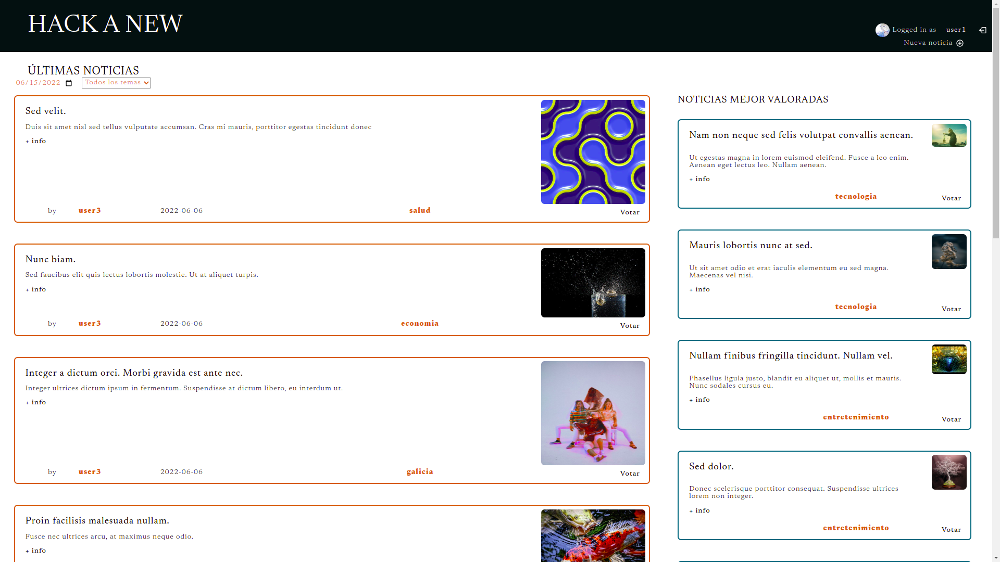
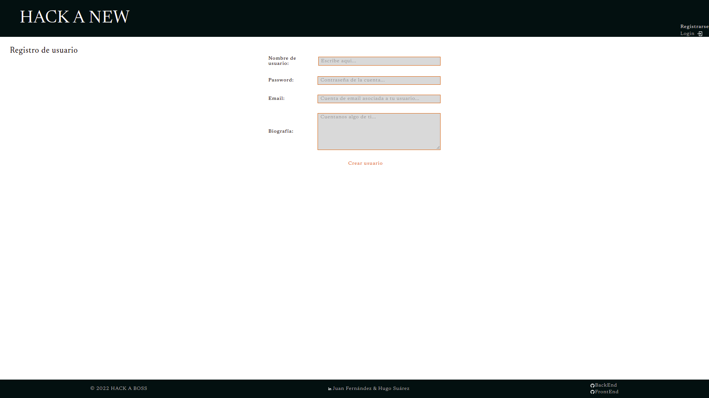
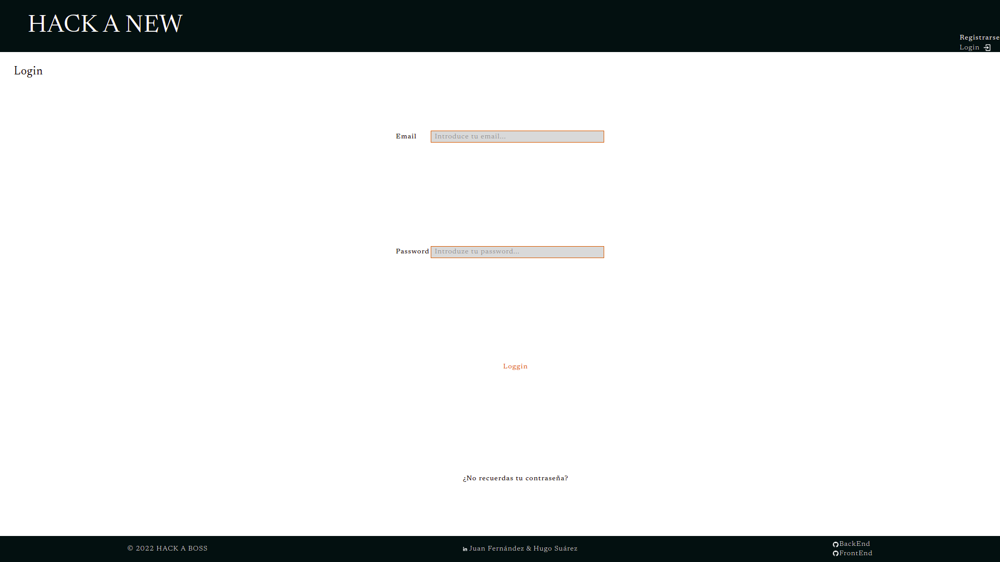
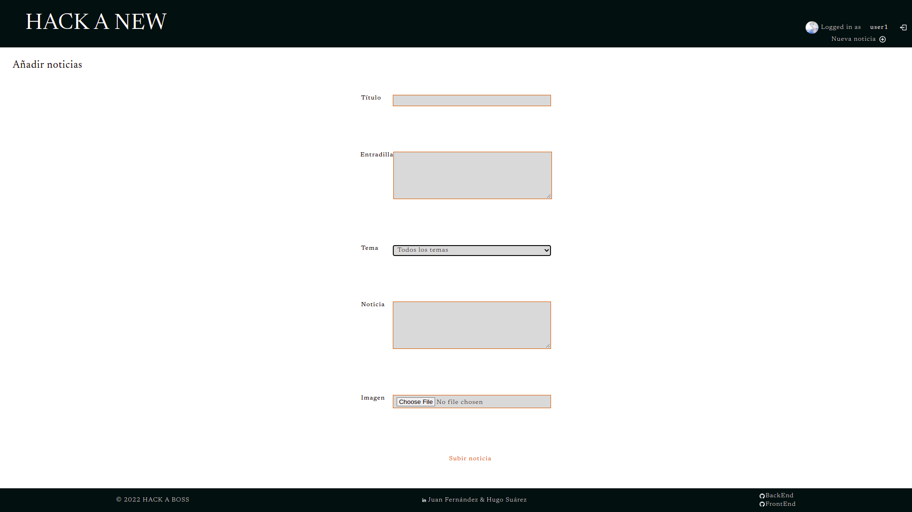
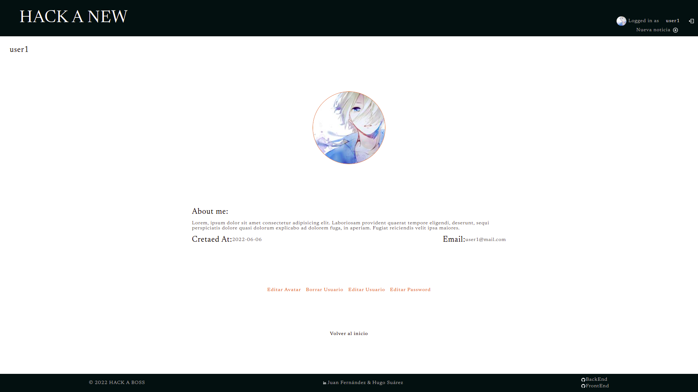

<div id="top"></div>

<!-- PROJECT LOGO -->
<br />
<div align="center">
  <a href='https://github.com/canojuan10/proyecto3_react'>
    
  </a>

<h3 align="center">Collaborative Online News Web</h3>

  <p align="center">
    BOOTCAMP HACK A BOSS-2022
    <br />
    <br />
    <a href="https://github.com/canojuan10/proyecto3_react/issues">Report issue</a>
   
  </p>
</div>

<!-- TABLE OF CONTENTS -->
<details>
  <summary>Table of Contents</summary>
  <ol>
    <li>
      <a href="#about-the-project">About The Project</a>
      <ul>
        <li><a href="#built-with">Built With</a></li>
      </ul>
    </li>
    <li>
      <a href="#getting-started">Getting Started</a>
      <ul>
        <li><a href="#installation">Installation</a></li>
      </ul>
    </li>
    <li><a href="#usage">Usage</a></li>
    <li><a href="#contact">Contact</a></li>
    <li><a href="#acknowledgments">Acknowledgments</a></li>
  </ol>
</details>

<!-- ABOUT THE PROJECT -->

## About The Project


</br>
</br>
HAB 2022 final project. FrontEnd for the API-REST of collaborative news, previously carried out. In the following <a href="https://github.com/wicket-warrick/PROXECTO2_NODE">link</A> you can find the BackEnd repository.</br>
The functionalities of creating user, logging...etc... have been developed. They will be described in the following document.
<p align="right">(<a href="#top">back to top</a>)</p>

### Built With

- [React.js](https://reactjs.org/)
- [Cretae React App.js](https://create-react-app.dev/)

<p align="right">(<a href="#top">back to top</a>)</p>

# Getting Started

In the next chapter you can read how to download and install the different components and utilities of this project.

### Installation

To get started, you must have a local copy on your computer.
There are two options:

A. CLONE the repo.

```sh
git clone git@github.com:canojuan10/proyecto3_react.git
```

B. DOWNLOAD the repo.
</br>
</br>
<a href='https://github.com/canojuan10/proyecto3_react/archive/refs/heads/main.zip'> Download repository</a>

### Config

1. Install NPM packages

   ```sh
   npm install
   ```

2. <p>Rename the '.example.env' file to '.env'; and configure the variables to be able to execute the project.</p>

3. To run the app

   ```sh
   npm start
   ```

   <p>If you have previously installed the  <a href='https://github.com/wicket-warrick/PROXECTO2_NODE/tree/main/documentacion/databaseExample'>sample database</a>, the application will launch correctly.
   You will have users and news to start testing the app.</br></br>
   </br>If you haven't installed the  <a href='https://github.com/wicket-warrick/PROXECTO2_NODE/tree/main/documentacion/databaseExample'>sample database</a>, the app will start with no news and no users.</p>

<p align="right">(<a href="#top">back to top</a>)</p>

## Usage

<h3>Home</h3>

<p>
In the home view, we have access to the latest news, being able to select the filtering date.
On the right side we can see the most voted news.</p>
<h3>Regiter-Create user</h3>

<p>In order to create a user, we must register with our email, pass and username. The bio is optional.</p>
<p>To finish the registration process, we must visit the link, which will be sent to our email account. Please, review the <a href='https://github.com/wicket-warrick/PROXECTO2_NODE#getting-started'>API-REST  documentation linked</a>.</p>
<h3>Loggin</h3>

<p>To be able to log in to the app, we will do it with the email account and the pass with which we registered.</p>
<h3>Create New</h3>

<p>To create news, we will do it from the Home view.<p>
<p>You can edit your news, and change the image.</p>
<h3>User</h3>

<p>From your profile, you can perform the basic operations of editing user and deleting user.</p>

<!-- CONTACT -->

## Contact

<h3>Hugo Suárez</h3>

[![Linkedin][linkedin-shield]](https://www.linkedin.com/in/hugosuarezdevp)

[![GitHub][github-shield]](https://github.com/wicket-warrick)

<h3>Juan Fernández</h3>

[![Linkedin][linkedin-shield]](https://www.linkedin.com/in/juanfernandezmirandacano)

[![GitHub][github-shield]](https://github.com/canojuan10)

<p align="right">(<a href="#top">back to top</a>)</p>

## Acknowledgments

- [HACK A BOSS](https://www.hackaboss.com/)

<p align="right">(<a href="#top">back to top</a>)</p>

[linkedin-shield]: https://img.shields.io/badge/LinkedIn-0077B5?style=for-the-badge&logo=linkedin&logoColor=white
[linkedin-url]: https://linkedin.com/in/othneildrew
[product-screenshot]: images/screenshot.png
[github-shield]: https://img.shields.io/badge/GitHub-100000?style=for-the-badge&logo=github&logoColor=white
[product-screenshot]: ./src/image/screenshot.png
